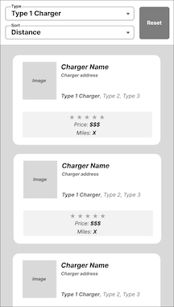

# Task List

You may do these tasks in any order, but take note that they are listed in the order your team has prioritized completing them.

Reminder that you are NOT expected to complete all tasks. You are expected to write clean, readable code. Remember to add comments explaining what you were working on if you run out of time in the middle of a task.

## Task 1

a. Station Data: In `src/components/StationCard.tsx`, add information about the distance to the
station, so that the station's details match the wireframe in `wireframe_list.png` (shown below).

b. Stars: Implement rendering for a station's star rating in `src/components/StarRating.tsx`.
Each station card should always show a total of five stars, with some stars filled in
and some stars unfilled depending on the station's rating.

You should use the CSS classes in `src/styles/StarRating.css`.

c. Loading Data: In order to display the full list of stations in our web app, we
first need to get the station and image data from a REST API endpoint. In
`src/helpers/fetchResults.ts`, implement

**`fetchSearchResults`**

The list of stations for each charger-type can be obtained by making a GET
request to https://api.byteboard.dev/data/v2/stations/{chargeId}

## Task 2

When users click a station, they are taken to the station details view. To match
the wireframe above, the station details view needs to have the
same specifications box (showing rating, price, and distance) that is present in
the station card in `src/components/StationCard.tsx`.

Add the specifications box to the details view currently in `src/components/StationDetails.tsx`, so
that it is visible from both views. For maintainability, you should avoid code
duplication where possible, and you are welcome to modify the existing
`src/components/StationCard.tsx` and/or create new functions, classes, or files.

## Task 3

Allow users to sort the station list view. Add a second dropdown to the header
that lets the user choose how they want to sort the station list: by distance,
name, rating, or price. When the user updates their selection, the list of
stations should sort by the selected property. Clicking "Reset" should reset
the sort picker to a default value (e.g. "distance").

Each sortable property should be ordered according to the requirements of the
app's design:

- distance: nearest to farthest
- name: alphabetically
- rating: highest to lowest
- price: lowest to highest

You are welcome to edit any existing file and/or create new files. You may find
it helpful to focus first on `src/components/Header.tsx` and `src/App.tsx`.

If you have remaining time after completing this task, updating the styling of the
header to match the wireframe in `wireframe_list.png` (shown below) would be a nice enhancement:

